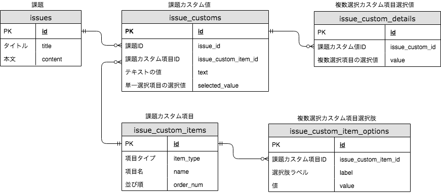

# README

## 前提条件

### Docker

Dockerをインストールし、`docker-compose` コマンドが利用可能になっている必要があります。

https://store.docker.com/search?type=edition&offering=community

### ポート

この課題プログラムは以下のポートを利用します。

| ポート | 用途 |
|-------|-----|
| 3000  | Rails |
| 3306  | MySQL |

ポートが他のプログラムで既に使われていないことを確認してください。

## 初期設定

課題実施の前に、以下のコマンドでデータベースを初期化してください。

```
docker-compose run --rm api bundle exec rake db:create
docker-compose run --rm api bundle exec rake db:schema:load
```

## 課題

### 課題1

以下のファイルで `pending` 状態になっているテストが通るように実装を修正してください(pendingの行を削除した状態でテストが通るようにしてください)。

- spec/models/issue_spec.rb
- spec/requests/issues/index_spec.rb

### テスト実行方法

```
docker-compose run --rm api bundle exec rspec
```

### 課題2

課題2は課題1の完了後に行ってください。

以下のコマンドで、課題2用の初期データを登録します。

```
unzip Trial2DataDump.sql.zip
docker-compose run --rm api /bin/sh -c 'mysql -h mysql -u root -ppassword trial_development < Trial2DataDump.sql'
```

以下のコマンドでサービスを起動します。

```
docker-compose up -d api
```

以下のコマンドを実行します。

```
curl --globoff 'http://localhost:3000/issues?title=ABC&issue_customs[][issue_custom_item_id]=2444&issue_customs[][selected_values][]=1&issue_customs[][selected_values][]=-1'
```

利用しているPCの性能にもよりますが、1分以上待っても処理が完了しないはずです。
curlコマンドを `ctrl + c` 等で終了し、以下のコマンドでサービスを再起動し、処理を強制終了してください。

```
docker-compose restart api
```

上記の通りパフォーマンスの悪い `/issues` 処理をチューニングしてください。
高速化の方法は自由に選択してもらって構いませんが、既存のRSpecのケースが通るように修正してください。
目標レスポンスタイムは2秒未満です。

## 課題データベースのER図

課題を進める際の参考にしてください。



## 課題の進め方

課題を進める上で、不明点などあればSlackで質問してください。WIP状態のプルリクエストを作成して相談していただいても大丈夫です。
課題にかける時間は課題1・2を合わせて、最大で8時間程度(1日稼働程度)を想定しています。これはあくまで目安時間であり、課題の時間制限ではありませんので、ご本人さえ問題なければ、もっと時間をかけて取り組んでいただいても結構です。

## 課題提出方法

このリポジトリ内に課題1、課題2の単位で別々にプルリクエスト(PR)を作成してください。ブランチ名、PRタイトルの命名規則は特にありません。
課題2のブランチは課題1のブランチから派生させ、PRは課題1のブランチに対して作成してください。

例えば、課題1のブランチ名が `trial1`、課題２のブランチ名が `trial2` だった場合、以下の2つのPRを作成してください。

- into `master` from `trial1` (trial1 から master へ向けたPR)
- into `trial1` from `trial2` (trial2 から trial1 へ向けたPR)

PRのタイトルは「課題1回答」、「課題2回答」のようにどの課題の回答かわかりやすい名前をつけてください。
PRを作成したら、Slackで担当者にレビュー依頼をお願いします。
課題1だけができた段階で、一旦課題提出(レビュー)に進んでもOKです。

課題2のプルリクエストの説明には、性能改善の度合いを確認できるよう、以下のように、チューニング後のRailsのCompletedログを記載してください。
ログは `log/development.log` に出力されます。

```
Completed 200 OK in 700ms (Views: 521.6ms | ActiveRecord: 173.8ms)
```

## その他

提出期限は特に定めておりませんが、1週間程度経過した段階で連絡がなかった場合、こちらから状況確認のメンションをさせていただく場合があります。
その後も1週間以上連絡が取れなかった場合は、選考辞退と判断してトライアルを終了いたしますのでご了承ください。
